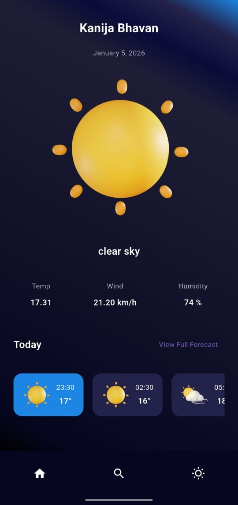
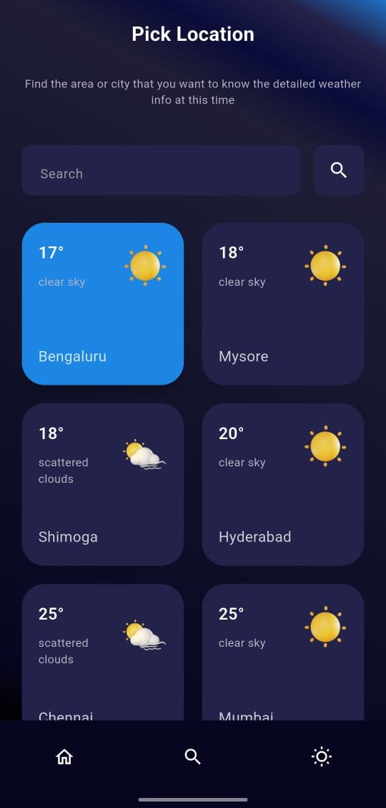

# Weather App 🌤️

A beautiful Flutter Weather App that shows current weather, hourly forecast, and lets users search for famous cities.  
Built with **Flutter**, **Riverpod** (or `setState`), and OpenWeather API 📍.

---

## 🛠️ Tech Stack

- **Flutter** – Frontend UI  
- **Dart** – Programming language  
- **OpenWeatherMap API** – Weather data provider  
- **Riverpod** – State management (if used)  
- **Dio** – Network requests  

---

## 🚀 Features

✔ Search for cities by name  
✔ View current weather information  
✔ View hourly weather forecast in a bottom sheet  
✔ List of famous cities for quick access  
✔ Clean UI with gradients and weather icons  
✔ Navigation to detailed weather screens
 
---

## 📱 Screenshots

### Home Screen (Weather Display)

### Search Weather

### Weather Details
![Weather Details](
  

---

## 🎯 Project Highlights

- 🚀 Real-time weather data using public APIs
- 📡 Search functionality
- 📱 Clean and intuitive UI

---

## 📄 License

MIT License © 2025 *mukundasv03*
