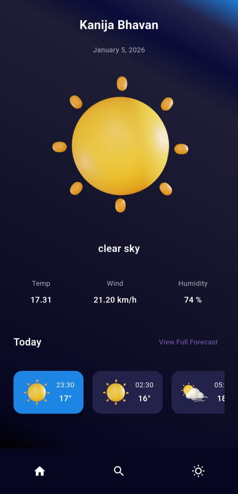
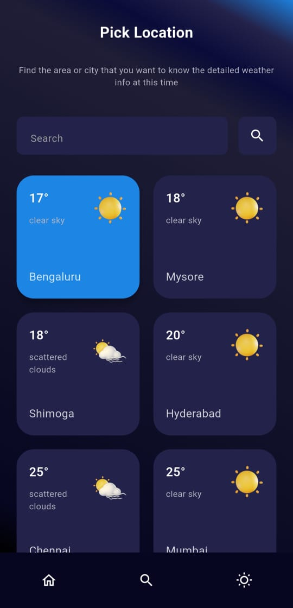
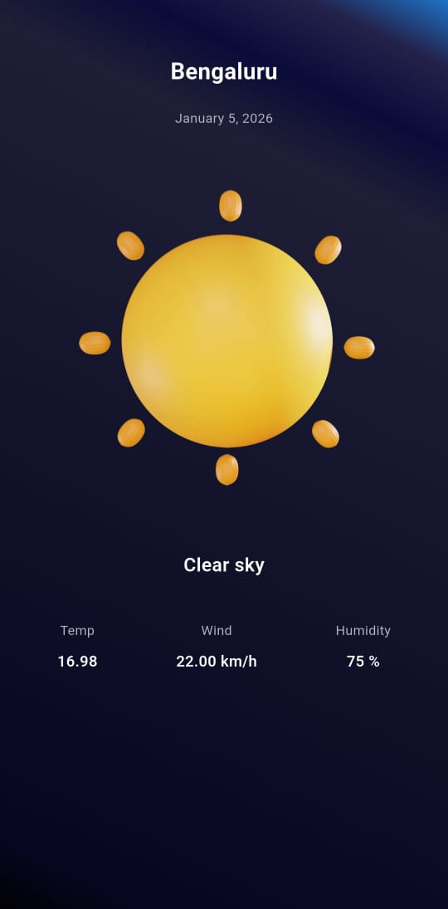
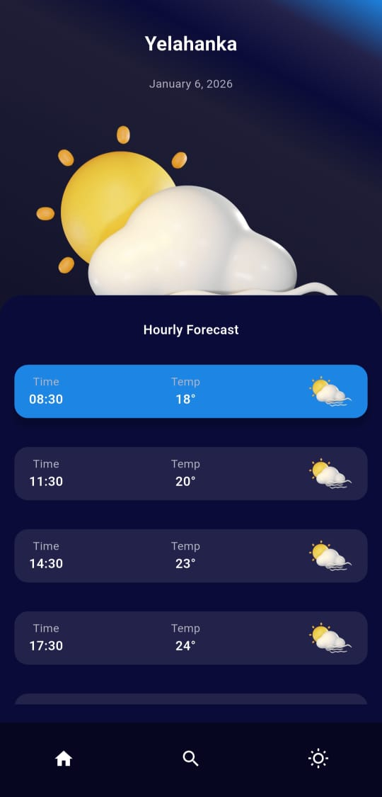
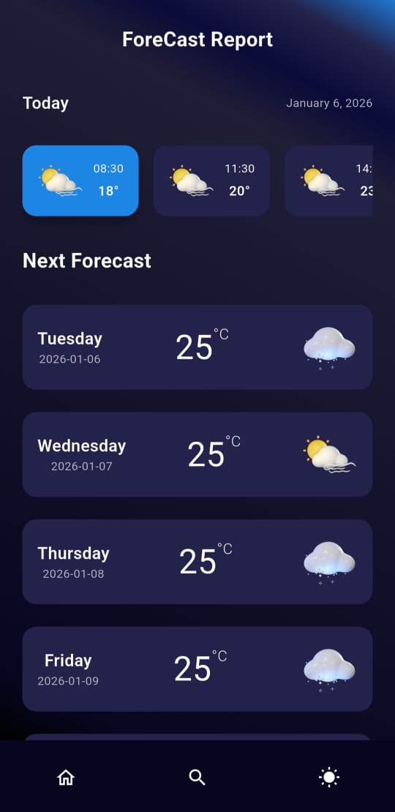

# 🌤️ Weather App

A Flutter weather app that shows current conditions, hourly forecasts, and lets users search for cities in real time.
Built with Flutter, Riverpod, and the OpenWeatherMap API.

---

## 🛠️ Tech Stack

Flutter, Dart, OpenWeatherMap API, Riverpod (state management), Dio (networking), Geolocator (device location), Jiffy (date formatting)

---

## 🚀 Features

✔ Search for cities by name
✔ View current weather information
✔ View hourly weather forecast in a bottom sheet
✔ List of famous cities for quick access
✔ Clean UI with gradients and weather icons
✔ Navigation to detailed weather screens

---

## 📱 Screenshots

### Home Screen (Weather Display) || Search Weather || Weather Details

&nbsp;&nbsp;&nbsp;&nbsp;&nbsp;&nbsp;&nbsp;&nbsp;&nbsp;&nbsp;&nbsp;&nbsp;&nbsp;&nbsp;&nbsp;&nbsp;

### Hourly Weather Screen || ForeCast-Report Screen

&nbsp;&nbsp;&nbsp;&nbsp;&nbsp;&nbsp;&nbsp;&nbsp;

---

## ⚙️ Getting Started

Clone the repository, run flutter pub get to install dependencies, add your OpenWeatherMap API key where the app expects it, then run flutter run. Requires Flutter SDK ^3.10.0.

---

## 🎯 Project Highlights

Real-time weather data from a public API, real-time city search, and a clean, gradient-based UI.

---

## 📄 License

MIT License © 2025 mukundasv03
